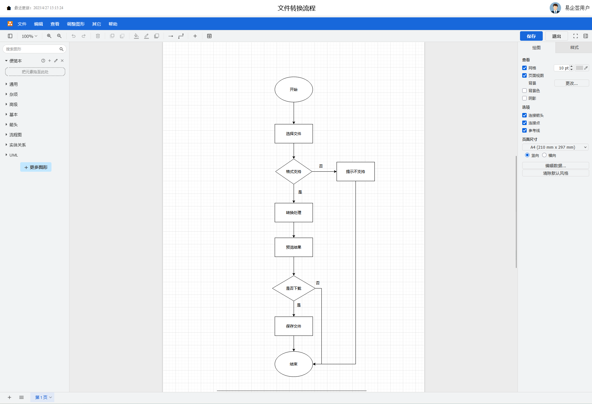

# 开源智能文档编辑器


一个本土化开源智能文档编辑平台，支持多种文档类型编辑和预览，包括 Word、Excel、PPT、Markdown、思维导图和流程图。

## 📌 项目简介

### 🌐 在线体验

**立即体验：[https://docs.signit.cn](https://docs.signit.cn)**

无需安装，直接访问体验全部功能！

开源智能文档编辑器是一款基于现代 Web 技术构建的全功能文档处理平台，专为满足中国用户的本地化需求而设计开发。作为纯前端实现的解决方案，它具有以下核心特点：

1. **多格式一体化编辑**
   集成 Word、Excel、PPT、Markdown、思维导图和流程图六大文档类型的编辑与预览功能，提供统一的用户界面和操作体验，消除不同软件间切换的繁琐。

2. **完全自主可控**
   采用 100%开源技术栈构建，所有数据处理均在浏览器端完成，不依赖任何第三方云服务，确保数据隐私和安全。基于 MIT 许可协议，企业可自由使用和二次开发。

3. **模块化架构设计**
   基于 Vue 3 的组合式 API 和 Pinia 状态管理，每个文档编辑器都是独立组件，支持按需加载和功能扩展。开发者可以轻松集成或替换特定模块。

4. **专业级文档处理**

   - Word 编辑器提供目录生成、电子签名等高级功能
   - Excel 组件支持公式计算和图表生成
   - PPT 引擎实现动画效果和演示模式
   - 技术文档编写完整的 Markdown 支持

5. **企业级特性**
   内置电子签名、文档水印、版本历史等企业场景必备功能，同时保持轻量级架构，兼顾功能丰富性和性能表现。

6. **开发者友好**
   提供完整的 TypeScript 类型定义和开发文档，基于 Vite 的极速构建体验，配套示例代码和测试用例，降低二次开发门槛。

本项目的技术选型聚焦于国内外主流开源方案，通过精心整合形成完整解决方案。


## 🚀 核心功能

### 📝 Word 文档编辑

- 富文本编辑：支持各种文本样式和格式
- 电子签名：内置 Vue3-esign 签名组件
- 智能目录：自动生成可导航文档目录
- 内容模板：预设常用内容库
- 安全水印：自定义文档保护水印
- 版本历史：编辑记录追溯


### 📊 Excel 表格处理

- 公式计算：支持常用 Excel 函数
- 数据操作：排序、筛选、条件格式
- 图表生成：多种数据可视化图表


### 🎨 PPT 演示文稿

- 元素类型：支持 文字、图片、形状、线条、图表、表格、视频、音频、公式 几种最常用的元素类型
- 动画效果：元素动画和切换效果
- 演示模式：全屏展示支持


### 📑 Markdown 编辑

- 双栏视图：实时编辑预览
- 语法高亮：完整 Markdown 支持
- 交互友好：支持所见即所得模式


### 🧠 思维导图

- 节点操作：自由添加/编辑节点
- 多种布局：树形、逻辑图等
- 主题定制：丰富样式选择


### ⛓ 流程图

- 图形元素：标准流程图组件
- 智能连线：自动路径规划
- 导出分享：支持 PNG/SVG 等格式



## 🛠️ 技术架构

### 🧩 核心框架

| 组件     | 技术栈     |
| -------- | ---------- |
| 前端框架 | Vue 3      |
| 开发语言 | TypeScript |
| 状态管理 | Pinia      |
| 构建工具 | Vite       |
| 路由管理 | Vue Router |

## 🛠️ 编辑器技术生态

### 📝 富文本编辑

| 技术       | 简介                               | 特点                              | 官方仓库                         |
| ---------- | ---------------------------------- | --------------------------------- | -------------------------------- |
| **Tiptap** | 基于 ProseMirror 的 Vue 富文本框架 | 支持扩展、协作编辑、Markdown 兼容 | [tiptap.dev](https://tiptap.dev) |

> 💡 提供完整的 Word 文档编辑能力，包括目录生成、电子签名等企业级功能

### 📊 电子表格

| 技术           | 简介                     | 特点                            | 官方仓库                                                     |
| -------------- | ------------------------ | ------------------------------- | ------------------------------------------------------------ |
| **Luckysheet** | 纯前端 Excel-like 表格库 | 支持公式/图表/冻结行列/导入导出 | [Luckysheet](https://dream-num.github.io/LuckysheetDocs/zh/) |

> 🔢 实现 95%+的 Excel 常用功能

### 🎨 幻灯片编辑

| 技术                        | 简介                                                                               | 特点                                                                                                               | 官方仓库                                           |
| --------------------------- | ---------------------------------------------------------------------------------- | ------------------------------------------------------------------------------------------------------------------ | -------------------------------------------------- |
| **PPTist(Apache 2.0 版本)** | 一个基于 Web 的在线演示文稿（幻灯片）应用，还原了大部分 Office PowerPoint 常用功能 | 支持 文字、图片、形状、线条、图表、表格、视频、音频、公式 几种最常用的元素类型，可以在 Web 浏览器中编辑/演示幻灯片 | [PPTist](https://github.com/pipipi-pikachu/PPTist) |

> ✨ 支持 PPT 所有基础元素+动画效果

### 📑 Markdown

| 技术               | 简介                 | 特点                         | 官方仓库                             |
| ------------------ | -------------------- | ---------------------------- | ------------------------------------ |
| **ToastUI Editor** | 双栏 Markdown 编辑器 | 实时预览/自定义语法/插件系统 | [ui.toast.com](https://ui.toast.com) |

> 🌟 支持 markdown/所见即所得 模式

### 🧠 思维导图

| 技术                | 简介             | 特点                     | 官方仓库                                                                            |
| ------------------- | ---------------- | ------------------------ | ----------------------------------------------------------------------------------- |
| **Simple-mind-map** | 轻量级思维导图库 | 多布局/节点样式/导入导出 | [Simple-mind-map](https://wanglin2.github.io/mind-map-docs/start/introduction.html) |

> 💭 支持 XMind 文件导入

### ⛓️ 流程图

| 技术               | 简介           | 特点                    | 官方仓库                   |
| ------------------ | -------------- | ----------------------- | -------------------------- |
| **Draw.io** (集成) | 流程图解决方案 | 200+图形库/多种导出格式 | [draw.io](https://draw.io) |

> 🔗 支持 VSCode 同款图形库和主题系统

## 🚀 快速开始

### 系统要求

- Node.js v18+

### 开发流程

```bash
# 克隆仓库
git clone https://github.com/SignitDoc/open-editor.git && cd open-editor

# 更换.npmrc中的tiptap-pro的token值
//registry.tiptap.dev/:_authToken=自己申请的token

# 安装依赖
npm install

# 启动开发服务器
npm run dev
```

### Docker 部署

您可以使用 Docker 快速构建和部署本项目：

```bash
# 编译项目
npm run build

# 构建 Docker 镜像
docker build -t open-editor:latest .

# 运行 Docker 容器
docker run -d -p 8080:80 --name open-editor open-editor:latest

# 访问应用
# 打开浏览器访问 http://localhost:8080
```

## 🤝 参与贡献

欢迎开发者通过以下方式参与项目贡献：

1. **代码贡献**

   - 提交 Pull Request 修复问题或添加功能
   - 确保代码符合项目编码规范
   - 为新功能添加相应的单元测试

2. **问题报告**

- 在[GitHub Issues](https://github.com/SignitDoc/open-editor/issues)提交问题
- 清晰描述问题现象和复现步骤

3. **文档改进**

   - 完善使用文档和开发指南
   - 翻译多语言文档
   - 添加代码注释

4. **社区支持**
   - 回答其他用户的问题
   - 分享使用案例和经验

## 📄 使用协议

### Apache License 2.0

## 📬 联系我们

- **问题反馈**
  [提交 Issue](https://github.com/SignitDoc/open-editor/issues/new/choose)
- **开发者邮箱**
  tzw@signit.cn
